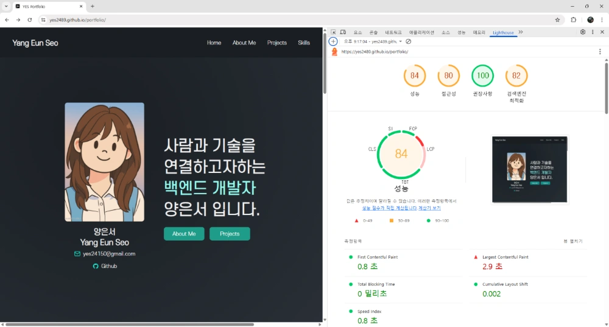
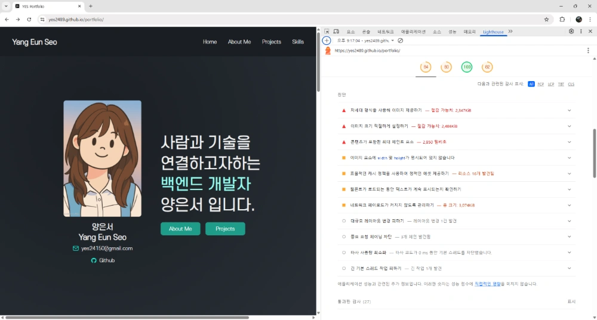

# HTML, CSS, JS 활용한 포트폴리오 작업 회고 (2025.07.09)

## 🔁 개선 및 변경 사항

### 1. 디렉토리 구조 및 정리

- 기존 `assets/` 중심 구조 → `src/assets/`, `src/styles/`, `src/js/` 로 **역할별로 분리하여 모듈화**
- 역할별 폴더 분리로 **유지보수성과 가독성 향상**

### 2. 정보 구조 재설계

- `Hero`, `About Me`, `Projects`, `Skills` 등으로 구분
- 각 섹션을 `<section>` 단위로 나누고, **title 위치, 배경, padding** 등 시각 구조 통일

### 3. 디자인 일관성 및 컴포넌트화

- `project-card`, `intro-card`를 **카드형 컴포넌트**로 통일
- 각 섹션의 콘텐츠 정렬, 글자 크기, 여백 등을 동일하게 유지하여 **UX 흐름 개선**

### 4. 인터랙션 및 동적 효과 추가

- `Hero` 슬로건에 **페이드 인 애니메이션**
- `IntersectionObserver`로 `Intro` 카드들이 스크롤 시 순차 등장
- 프로젝트 카드 `hover` 시 약간 확대되며 그림자 강조

### 5. 내비게이션 구조 개선

- 기존 외부 링크 → `#home`, `#aboutMe`, `#projects`, `#skills`로 **앵커 구조 변경**
- `scroll-margin-top` 처리로 고정 헤더 하단에 섹션이 잘리거나 붙지 않도록 조정
- `scrollIntoView`로 부드러운 스크롤 이동

### 6. 뷰포트 단위 레이아웃 정비

- `min-height: 90vh`를 섹션에 적용해 스크롤 시 한 화면에 한 블록이 자연스럽게 진입
- 콘텐츠 높이에 따라 **padding 조절**, 레이아웃 비대칭 방지

---

<details>
<summary><h2>✍️ UI 구조 및 동작 흐름 설계 포인트</h2></summary>

### 1. `DOMContentLoaded`에서 기능별 초기화 함수 분리

JavaScript 초기화 시점에서 DOM이 완전히 로드된 후 실행되도록 하기 위해 `DOMContentLoaded` 이벤트 안에서 **기능별로 함수를 분리**

```js
document.addEventListener("DOMContentLoaded", () => {
  fadeInMainContent(); // 메인 슬로건 fadeIn
  setupSmoothScroll(); // 내부 링크 부드러운 스크롤
  observeIntroCards(); // About Me 카드 등장 애니메이션
});
```

> 기능을 별도 함수로 나누어 역할 명확성, 가독성, 유지보수성을 높임

#### `window.onload`와의 주요 차이점

- DOMContentLoaded는 스타일시트, 이미지, 하위 프레임의 로드를 기다리지 않기 때문에 window.onload보다 훨씬 빨리 발생
- DOM이 준비되자마자 JS를 초기화해야 하는 경우 DOMContentLoaded를 사용
- 페이지의 모든 콘텐츠(이미지 및 스타일시트 포함)에 의존하는 작업을 수행해야 하는 경우 window.onload를 사용

#### 각 이벤트의 사용 시기

- **DOMContentLoaded**: UI 구성 요소를 초기화하거나, 이벤트 리스너를 설정하거나, DOM이 사용할 수 있게 되자마자 조작하는 작업에 이상적
- **window.onload**: 모든 리소스가 로드된 후에 수행해야 하는 이미지 슬라이더 설정 또는 이미지가 완전히 로드된 후 크기가 결정되는 요소에 대한 작업에 적합

---

### 2. 내부 스크롤 이동: `scrollIntoView` vs 직접 계산

- 내부 앵커 이동을 부드럽게 처리하기 위해 `scrollIntoView()`를 사용 함
- **단순하면서도 직관적이고 브라우저 호환성도 우수**하기 때문에 적합하다고 판단하였음

```js
function setupSmoothScroll() {
  // href가 "#"로 시작하는 모든 내부 링크 선택
  const links = document.querySelectorAll("a[href^='#']");

  // 각 링크에 클릭 이벤트 등록
  links.forEach((link) => {
    link.addEventListener("click", function (e) {
      e.preventDefault(); // 기본 동작 막기

      // 클릭한 링크의 href 속성값 추출
      const targetId = this.getAttribute("href");

      // 해당 id를 가진 요소를 선택
      const target = document.querySelector(targetId);

      // 부드럽게 스크롤 이동
      target.scrollIntoView({ behavior: "smooth" });
    });
  });
}
```

> fixed header의 높이를 반영하기 위해 `scroll-margin-top` 속성을 CSS에서 활용하여 조정하였음

```css
#home,
#aboutMe,
#projects,
#skills {
  scroll-margin-top: 75px;
}
```

---

### 3. `IntersectionObserver`를 활용한 카드 애니메이션 설계

**스크롤 위치에 따라 카드가 자연스럽게 떠오르는** 효과를 만들기 위해 브라우저 API인 `IntersectionObserver`를 도입

```js
function observeIntroCards() {
  const cards = document.querySelectorAll(".intro-card");

  // IntersectionObserver
  // 특정 DOM 요소가 화면에 들어오거나 나갈 때 자동으로 콜백 실행
  const observer = new IntersectionObserver(
    (entries) => {
      entries.forEach((entry) => {
        const card = entry.target;

        if (entry.isIntersecting) {
          // 카드가 화면에 보일 때
          // 모든 카드 중 현재 카드의 순서를 찾아 딜레이 적용
          cards.forEach((el, index) => {
            if (el === card) {
              setTimeout(() => {
                card.classList.add("show");
              }, index * 200); // 순서에 따라 애니메이션 딜레이
            }
          });
        } else {
          // 카드가 화면에서 사라질 때 제거
          card.classList.remove("show");
        }
      });
    },
    {
      threshold: 0.1, // 관찰 대상 요소가 10% 이상 화면에 들어오면 isIntersecting: true
      rootMargin: "0px 0px -50px 0px", // 관찰 범위 설정
      // 카드가 화면 아래 50px 전 쯤에서 threshold에서 설정한 값 이상 보이면 애니메이션 시작
    }
  );

  // 모든 카드를 관찰 대상으로 등록
  cards.forEach((card) => observer.observe(card));
}
```

> `setTimeout`을 이용해 등장 순서를 조절하여 보다 **동적인 사용자 경험을 유도**

---

### 4. HTML 구조상 고민: `<a>` 태그로 카드 전체 감싸기

`project-card` 전체를 `<a>`로 감싸야 전체 클릭이 가능하지만, HTML5 문법 상 `<a>`가 블록 요소를 감싸는 것이 허용된다는 점을 고려하여 아래와 같이 작성하였음

```html
<a href="..." target="_blank" class="project-card">
  
  <div class="project-skills">...</div>
  <div class="project-container">...</div>
</a>
```

> 이를 통해 카드 전체 클릭이 가능하면서도 시멘틱 구조를 해치지 않는 방법을 선택 함

</details>

---

## 📊 Lighthouse 진단 기반 개선 예정 사항

> 본 포트폴리오 사이트는 Google Lighthouse 진단 결과를 바탕으로, 다음과 같은 항목을 중심으로 향후 개선을 진행할 예정입니다.




### 1. 이미지 최적화

- 기존 `.png` 이미지 중 용량이 큰 항목을 `WebP` 형식으로 전환
- 실제 표시 크기에 맞는 이미지 리사이징 및 `` 태그에 `width`/`height` 속성 명시
- 주요 이미지에 `preload` 적용하여 LCP (Largest Contentful Paint) 지연 완화

### 2. 렌더링 성능 개선

- 메인 텍스트 폰트에 `font-display: swap` 속성 적용 → 초기 렌더링 지연 방지
- Hero 섹션의 핵심 콘텐츠에 `lazy-loading` 대신 `preload` 방식 적용 고려

### 3. 접근성 향상

- alt 속성이 누락된 이미지 및 아이콘 요소 보완

### 4. 정적 자원 캐싱 및 전달 최적화

- 빌드 도구를 도입하거나 CDN 연동을 통해 정적 리소스(`.css`, `.js`, `.png`)에 `cache-control` 헤더 설정 계획
- GitHub Pages 한계를 보완할 수 있는 배포 구조 검토

### 5. 반응형 UX 보완

- 모바일 해상도에서 과도한 여백(`padding: 10em`)을 줄이고, 콘텐츠 간 배치 최적화
- 다만, 데스크탑 기준에서는 디자인 일관성을 유지할 계획

---

## 📌 다음 작업 계획

- Skills 섹션 Progress UI 추가
- 프로젝트 상세 페이지 연결 및 설명 보강
- SEO 최적화

---

## 🌱 회고 / 느낀 점

- 정적인 HTML 구조에서 벗어나 **사용자 흐름을 고려한 인터랙션 중심의 웹 설계**를 직접 해볼 수 있었음
- 단순히 보이는 화면이 아닌, **스크롤 위치, 등장 타이밍, 시각 집중도**까지 고려해야 UX가 좋아진다는 것을 체감
- 앞으로의 웹 프로젝트에서도 **디자인 → 레이아웃 → 동작 흐름 → 사용자 시선**까지 고민하는 것이 필요하겠음
